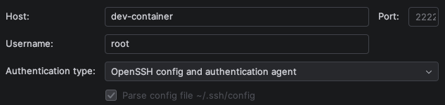

# Using Apple Containers as Development Containers

This project's purpose was to play around with Apple's container system while learning about containers and images in 
general. The goal was to create a reusable software development environment that provides a set of needed 
dependencies. In other words: I was trying to work towards a solution that mimics the basics of a Docker development 
container.

## Requirements

The things I expected my software development environment/container to provide:

- It uses the **Apple container system**.
- It provides a set of **dependencies** that are needed for the projects I work on, e.g. `node`.
- It allows `SSH` connectivity that works with e.g. **JetBrains Gateway**.
- It **becomes available on local login automatically**.
- It requires a **minimum of maintenance effort**.

## Prerequisites

- macOS 26 or newer
- OpenSSH
- An `SSH` key pair, added to the keychain with `ssh-add --apple-use-keychain`, as described on 
  [GitHub](https://docs.github.com/en/authentication/connecting-to-github-with-ssh/generating-a-new-ssh-key-and-adding-it-to-the-ssh-agent#adding-your-ssh-key-to-the-ssh-agent)
- [Apple's container system](https://github.com/apple/container/releases), see also its 
  [command reference](https://github.com/apple/container/blob/main/docs/command-reference.md)
- [JetBrains Gateway](https://www.jetbrains.com/remote-development/gateway/)

Tested with macOS 26.6.2 and version 1.0.0 of the container system. The container system is still moving quickly, so 
some of the commands below may behave differently on other versions.

## Quickstart

The sections after this one explain every step in detail. To get going:

1. Clone the repository:
   ```
   git clone https://github.com/LuggaLugga/dev-container.git
   cd dev-container
   ```
2. If Rosetta isn't installed on your Mac, disable it for builds, see [Disabling Rosetta](#disabling-rosetta).
3. Create the directory that will be shared with the container, or pick a different one and adjust the `-v` option in 
   `setup-dev-container.sh`:
   ```
   mkdir -p ~/workspace
   ```
4. Build the image, from inside the `scripts` directory:
   ```
   cd scripts
   ./build-dev-image.sh
   ```
5. Create and start the container with `./setup-dev-container.sh`, also from `scripts`.
6. Append the [configuration block](#setup) to `~/.ssh/config`.
7. Check the connection with `ssh dev-container`.
8. Set up the [LaunchAgent](#launchagent) so the container starts at every login.

### What to adjust

The names and values used here are choices, not requirements. `dev-image` (in `build-dev-image.sh` and 
`setup-dev-container.sh`) and `dev-container` (in `setup-dev-container.sh`, `start-dev-container.sh` and the `SSH` 
configuration) can be renamed, as long as they stay the same in every file. The same goes for port 2222, the memory 
limit of 8 GB, the shared directory `~/workspace`, the key `~/.ssh/id_ed25519` and the list of packages installed in 
the Containerfile.

## Solution and Learnings

The solution consists of a **Containerfile**, which is built into an image using the Apple container system and 
installs the required set of dependencies during this process. In addition, the Containerfile prepares the image so 
that the resulting container can accept `SSH` connections via the JetBrains Gateway (or the terminal). To ensure that 
the development container is always available and does not need to be started manually, a `LaunchAgent` is set up 
using a **Property List** (`plist` file) to run a shell script. The solution also provides **additional shell 
scripts** that make maintaining the development environment — based on the existing Containerfile and the Apple 
container system — as simple as possible.

### Containerfile

The image is based on `debian:stable-slim`. My intention was to use a well-known image that was as small as possible, 
and I deliberately chose not to pin it to a specific version so that I would get the latest stable version with every 
build. The JetBrains Gateway installs a JetBrains runtime for the IDEs inside the container, which requires `glibc`. 
Alternatives like Alpine provide `musl`, causing the runtime to throw an error at startup.

We include `SHELL ["/bin/bash", "-o", "pipefail", "-c"]` to apply the `pipefail` option. It matters for the two `curl` 
calls below, which download a script and pipe it straight into a shell: if the download fails, the shell simply 
receives an empty script, runs nothing, and reports success. The build continues and produces an image in which the 
tool is silently missing. With `pipefail`, a failure anywhere in that chain is treated as a failure of the whole line, 
and the build stops. Because `pipefail` is a shell option, we have to set it by replacing the default shell, which is 
what `SHELL` does. Bash comes along because Debian's default shell, `dash`, doesn't offer the option. `-o pipefail` 
switches it on, and `-c` tells the shell to take the text of each `RUN` line as the command it should run.

The following commands are chained with `&&` so that each one runs only if the previous one succeeded; as soon as one 
fails, the rest are skipped and the build stops.

We refresh the package index with `apt-get update`, which is what tells `apt` which packages exist and where to fetch 
them from. Since we can't interact with the shell during the build, but `apt-get install` asks for confirmation before 
installing, we use `-y` to answer that prompt in advance. `--no-install-recommends` limits the installation to what 
the packages actually require, leaving out the extras Debian merely recommends. This is followed by the set of 
dependencies to be installed. The last two commands clean up after the installation. `apt-get clean` deletes the 
downloaded package files (`.deb` files), which `apt` keeps after unpacking them; the installed programs themselves are 
not affected. `rm -rf /var/lib/apt/lists/*` deletes the package index fetched by `apt-get update`, which is only 
needed while installing.

The next two lines install uv and Claude Code using the installation commands from their official documentation.

`EXPOSE 22` declares that the container provides a service on port 22, the default port for `SSH`. It does not open 
the port by itself: to reach the `SSH` server from outside, the port has to be published when starting the container.

`CMD ["/usr/sbin/sshd", "-D"]` starts the `SSH` server when the container starts. A container keeps running only as 
long as its main process does, and `sshd` normally moves itself into the background and lets the original process 
exit, which would stop the container immediately. The `-D` flag keeps `sshd` in the foreground, so the container stays 
up for as long as the `SSH` server runs.

### Build

The build command is wrapped in a small shell script, `build-dev-image.sh`, so that it doesn't have to be remembered 
or retyped, and so that details such as the image name stay in one place. `-f` specifies the path to the Containerfile, 
and `-t` assigns the name `dev-image` to the resulting image, which is used later to start the container.

The Containerfile sits one directory above the scripts, which is why the path is written as `../Containerfile`. It is 
interpreted relative to the directory the script is run from, so run the script from the directory it lives in. If the 
Containerfile is placed elsewhere on your machine, adjust the path accordingly.

### Setup

`setup-dev-container.sh` starts a new container from the built image and automates the surrounding steps, so that as 
little as possible has to be done by hand.

By default, a shell script does not stop when a command fails; it simply continues with the next one. `set -e` changes 
this, so the script stops as soon as a command fails. Commands whose failure is expected are exempted with `|| true`, 
for example when there is nothing to clean up or no keys are stored in the keychain.

The first two commands clean up after a previous run, so that the script can be run again after rebuilding the image 
without any manual steps. `container rm -f dev-container` removes an existing container with the same name, which 
would otherwise prevent the new one from starting. `ssh-keygen -R "[localhost]:2222"` removes the entries for this 
address from `~/.ssh/known_hosts`: the `SSH` host keys are generated when the image is built, so every rebuild 
produces new ones, and `ssh` would otherwise refuse to connect with a warning that the host key has changed.

The `ssh-agent` holds unlocked keys for the current session and can be forwarded to a host, so that the key stays on 
the Mac while programs on the host can still use it. That is what we want here: `git` inside the container should be 
able to reach GitHub over `SSH` with the local key, without storing a private key in the container.

Adding a key with `ssh-add ~/.ssh/id_ed25519` is enough if the key has no passphrase, and a plain `ssh-add` loads all 
valid keys found in the usual locations. With `ssh-add --apple-use-keychain`, the key's passphrase is additionally 
stored in the macOS keychain and the key is loaded into the agent, as described on 
[GitHub](https://docs.github.com/en/authentication/connecting-to-github-with-ssh/generating-a-new-ssh-key-and-adding-it-to-the-ssh-agent#adding-your-ssh-key-to-the-ssh-agent). 
Since the agent does not survive a reboot, all keys stored this way can be loaded back into it with 
`ssh-add --apple-load-keychain`, which is what `setup-dev-container.sh` and `start-dev-container.sh` do. Whether a key 
is loaded can be checked with `ssh-add -l`.

JetBrains Gateway does not use `OpenSSH` for `SSH` connections, but its own implementation (`SSHJ`). It does read 
`~/.ssh/config`, but only takes the connection details from it, such as `HostName`, `Port`, `User` and `IdentityFile`. 
Options that control the behavior of the `OpenSSH` client are ignored, including `AddKeysToAgent`, `UseKeychain` and 
`ForwardAgent`. Gateway therefore authenticates with the key from `IdentityFile`, but does not add it to the 
`ssh-agent`, and does not forward the agent on its own. Instead, in every new session, Gateway asks where the key 
should come from as soon as a command first needs one (such as `git push`): either the local `ssh-agent` is forwarded 
to the container, or a key is specified directly by its path. If the agent is chosen, the key must be loaded into it 
before it is needed, which is why the scripts call `ssh-add --apple-load-keychain`.

Append the following block to `~/.ssh/config`. If you use a key other than `~/.ssh/id_ed25519`, adjust `IdentityFile` 
here and the mounted public key in the setup script accordingly.

```
Host dev-container
    HostName localhost
    Port 2222
    User root
    # Private key matching the public key mounted into the container.
    IdentityFile ~/.ssh/id_ed25519
    # Add the key to the ssh-agent when it is used (OpenSSH only).
    AddKeysToAgent yes
    # Store and read the key's passphrase in the macOS keychain (OpenSSH only).
    UseKeychain yes
    # Forward the local ssh-agent to the container, e.g. for git (OpenSSH only).
    # Only enable this for hosts you trust.
    ForwardAgent yes
```

`IdentityFile` is not strictly required for `OpenSSH`: without it, `ssh` looks for keys in the usual locations and 
tries them one after another until the host accepts one. It is listed here because Gateway reads this field to decide 
which key to authenticate with. `ForwardAgent` is deliberately limited to `dev-container` rather than set for all 
hosts: anyone with root access on a host you are connected to can use the forwarded agent, and with it your key, for 
as long as the connection is open.

`container run` then starts a new container from `dev-image`. `-d` runs it in the background, `--name dev-container` 
gives it the name used above, and `-m 8G` limits its memory to 8 GB. `-p 2222:22` connects port 2222 on the host to 
the `SSH` port 22 in the container, which is why the container is reached at `localhost:2222`. Port 22 on the host is 
deliberately avoided, since it is reserved for the Mac's own `SSH` server, which occupies it as soon as Remote Login 
is enabled. The two `-v` options make files from the host available in the container: the public `SSH` key is mounted 
read-only (`:ro`) as `/root/.ssh/authorized_keys`, which allows logging in as root with the matching private key, and 
`~/workspace` is mounted as `/root/workspace`, so changes made in the container are stored on the host and survive 
removing the container. That directory has to exist before the script is run; any other directory works just as well, 
as long as the `-v` option is adjusted to point at it.

To connect from the terminal, use `ssh dev-container`, or `ssh -p 2222 root@localhost` without the configuration block 
above.

### JetBrains Gateway

An `SSH` connection that matches the setup described here can be created in Gateway as follows:



Enter `dev-container` as the host, `root` as the user, and select `OpenSSH config and authentication agent` as the 
authentication type. Gateway then reads the remaining values from the entry added to `~/.ssh/config` above, which is 
required for this to work. The configuration can be verified with `Test Connection`.

Once the connection is established, Gateway downloads and installs a JetBrains runtime inside the container, which is 
why the image has to be based on `glibc`. The first connection therefore takes noticeably longer than the following 
ones.

Despite the name of the authentication type, Gateway does not simply use the local `ssh-agent`: as described above, it 
asks where the key should come from the first time a command inside the container needs one. Choosing the agent 
requires the key to be loaded, which `start-dev-container.sh` takes care of at every login.

### Start

After rebooting macOS, the keys are no longer loaded in the `ssh-agent`, which only exists for the current login 
session, and the container system as well as the container itself are no longer running either. To avoid having to 
take care of this by hand every time, `start-dev-container.sh` can be run automatically at every login. macOS provides 
so-called `LaunchAgents` for this: jobs that `launchd` starts in the background in the context of a user.

The `export` is needed because `launchd` runs the script in its own environment, which differs from that of the 
terminal. In the context of `launchd`, it should be assumed that paths such as `/usr/local/bin`, where `container` is 
installed, are not part of the search path. Alternatively, `container` can be called with its full path, 
`/usr/local/bin/container`, every time.

The script then loads the keys into the `ssh-agent` with `ssh-add --apple-load-keychain`, as described under Setup: 
this loads exactly those keys whose passphrase is stored in the macOS keychain. That way, only the keys deliberately 
registered there are loaded, without having to list them individually in the script.

Next, `container system start` starts the runtime environment that all `container` commands rely on, and 
`container start dev-container` starts the container itself. This requires that the container was created beforehand 
with `setup-dev-container.sh`.

### LaunchAgent

For the script to run at login, a file `~/Library/LaunchAgents/local.start-dev-container.plist` is required. This is 
an `XML` document that describes the job for `launchd`. `RunAtLoad` makes it start at login. Output and error messages 
are written to the specified files under `/tmp`, which helps with troubleshooting. `ProgramArguments` must contain the 
full path to the script, since `launchd` resolves neither `~` nor `$HOME`. Replace `USERNAME` and 
`PATH_TO_REPOSITORY` below with the actual path to your clone of this repository, for example 
`/Users/jane/dev-container/scripts/start-dev-container.sh`.

```xml
<?xml version="1.0" encoding="UTF-8"?>
<!DOCTYPE plist PUBLIC "-//Apple//DTD PLIST 1.0//EN" "http://www.apple.com/DTDs/PropertyList-1.0.dtd">
<plist version="1.0">
    <dict>
        <key>Label</key>
        <string>local.start-dev-container</string>
        <key>ProgramArguments</key>
        <array>
            <string>/Users/USERNAME/PATH_TO_REPOSITORY/scripts/start-dev-container.sh</string>
        </array>
        <key>RunAtLoad</key>
        <true/>
        <key>StandardOutPath</key>
        <string>/tmp/start-dev-container.out</string>
        <key>StandardErrorPath</key>
        <string>/tmp/start-dev-container.err</string>
    </dict>
</plist>
```

Since `launchd` calls the script directly, it has to be executable. This is already the case for a fresh clone of this 
repository, but if you moved or recreated the script, set it with:

```
chmod +x /Users/USERNAME/PATH_TO_REPOSITORY/scripts/start-dev-container.sh
```

The plist is loaded automatically at the next login. To activate it right away, for example for testing:

```
launchctl bootstrap gui/$(id -u) ~/Library/LaunchAgents/local.start-dev-container.plist
```

After changing the plist, it has to be unloaded first:

```
launchctl bootout gui/$(id -u)/local.start-dev-container
```

`gui/$(id -u)` specifies where the job runs: in the login session of the current user, which is also where the 
`ssh-agent` and the keychain are available. `id -u` returns the user's numeric ID (usually `501` for the first user on 
a Mac), so the command works for every user without adjustment.

## Limitations

A few things are worth knowing before using this setup:

- `setup-dev-container.sh` removes the existing container without asking. Everything inside it is lost except for what 
  lives in the mounted `~/workspace`, so keep your work there.
- Everything in the container runs as root. That is convenient for a local development container, but it is not a 
  hardened setup.
- Rebuilding the image generates new `SSH` host keys, which is why `setup-dev-container.sh` clears the matching entry 
  from `~/.ssh/known_hosts`. If you connect using an address other than `localhost:2222`, for example `127.0.0.1`, 
  that entry has to be removed by hand.
- The dependencies are not pinned to specific versions, and neither is the base image. Every build may therefore 
  produce a slightly different environment.

## Other learnings

### Disabling Rosetta

The builder VM has Rosetta enabled by default (`[build] rosetta = true`), even for arm64 builds that don't need it. If 
Rosetta isn't installed, the VM configuration is rejected and the build fails right away 
([apple/container#103](https://github.com/apple/container/issues/103)). It can be turned off in 
`~/.config/container/config.toml`, using the format shown by `container system property list`:

```toml
[build]
rosetta = false
```

The configuration is read at startup, so the runtime has to be restarted afterward with 
`container system stop && container system start`.

### Locale warnings on connect

macOS sends its locale environment variables along when opening an `SSH` connection and tries to set them on the 
target host as well. The locale it sends does not exist in the container (currently Debian 13.5), which results in 
warnings on every connection. In Apple's Terminal app, sending them can be disabled under 
`Settings > Profiles > Advanced` by unchecking "Set locale environment variables on startup". For terminals that don't 
offer this option, the system-wide `SSH` configuration has to be overridden instead: open 
`/etc/ssh/ssh_config.d/100-macos.conf` with `sudo` and comment out `SendEnv` with `#`.
